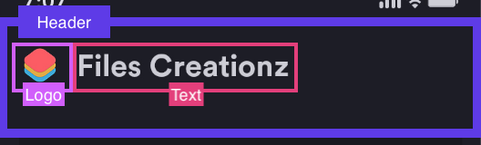

# Interface 01 - Breakdown

This interface design is created by [M S Brar](https://dribbble.com/msbrar) on Dribbble. Just to be extra clear, I did not and am not taking credit for this design. I'm simply using it for my own personal education reasons. If you like or want to know more about the design, please contact the original designer, MS Brar.

Here's my mission:

1. **Breakdown the design into visual components. (Where you currently are)**
2. Build the components with react. (using codesandbox)
3. Add animations with react-pose or react-anime (not sure yet)

# The Breakdown

Here's the screen I'll be developing:

Just from taking a glance here's what I can see:

1. There's a header containing the current screen we're on.
2. There are 6 items laid out in a 2 col 3 row grid.

Now with the quick glance taken care of, I want to know what I need before moving on. I need to know the colors used, what font-family to use, and how I'm going to create the icons used here. Usually if you're working for a company, all of those details will be provided for you by your designers.

I'm using a screen shot taken from a dribbble shot, so I'll do my best to match everything using some tools.

For color matching, my go to is: [color picker eyedropper](https://chrome.google.com/webstore/detail/colorpick-eyedropper/ohcpnigalekghcmgcdcenkpelffpdolg?hl=en) (chrome extension). For type matching, I'm just using google fonts and my eye. And for the icons, I'll generate svgs using [Sketch](https://www.sketchapp.com/).

I don't necessarily have a built in process when it comes to designing or developing, but I do like to start as basic and as simple as I can. So I'll start building this interface by figuring out the basic layout.

## Layout Components

I mentioned above that there I could see at first glance a header and 6 items. I can rephrase that and instead say I see a header and a main content area. Because I'm more of a visual person, here's what I mean drawn out.

Now, because I'm working in react I want to use one of reasons react is known for and thats: Component Reusability. The header section I have labeled above is pretty self-explanatory so a renaming is not needed. The main section, however, should be renamed to something that makes more sense. And this is because we might need to reuse it later on in our application. I believe it's best to get used to doing this no matter the size of your app.

I'm going to rename this section as ItemGrid, like so:

Okay, now we have our basic section components for our layout. Let's move on. We'll first break down the `Header` component and then we'll move onto breaking down `ItemGrid`.

## Smaller Components

**Header**

The `Header` component consists of two things: a logo, and some text. If we visually break it down, we'll get this:

Now, let's work on the `ItemGrid` component.

**ItemGrid**

The `ItemGrid` component contains 6 items (in this case). Each item contains an icon followed by some text. Easy enough right? Again let's visually break this down and get this:

Awesome! We've broke down both layout components, `Header` and `ItemGrid`, and visually painted a picture that we can come back to. I personally always do this when I need to break down and interface. Trying to solve what is what when you're actually coding is a pain. Also, if you're working with a team of developers, visually breaking it down like I did will help build the same visual model to follow for everyone.

We might agree that each item should contain this or that. But we'll 9/10 picture it in a different way. When you actually work together and make a visual breakdown of something, then everyone knows exactly how things should work and look.

Now that the breakdown is done, it's time to start building!
